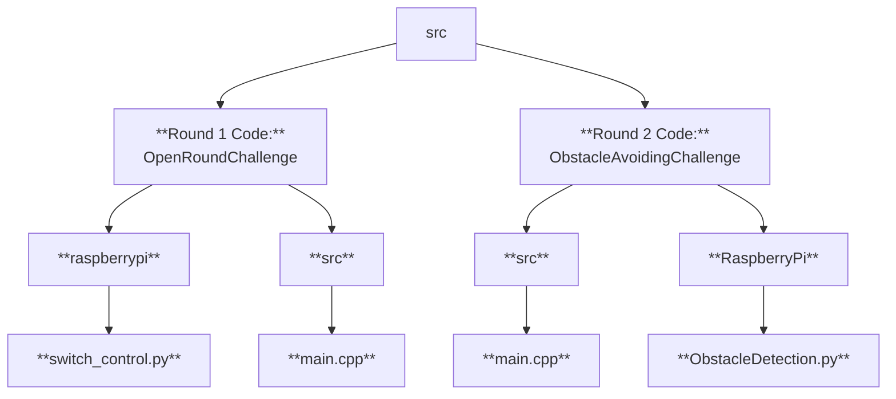

WRO Future Engineer's Self Driving Vehicle - Open Round Code:
====
- This folder contains the reference code for the Open Challenge Round using an ESP32
- This code implements logic like steering, motor control and sensor integration to help this vehicle navigate.

---
## FILE OVERVIEW 📂🗂️


## HARDWARE USED ⚙️⚙️
- Microcontroller: [ESP-WROOM-32] **ESP32 Dev Board**
- Steering: **Servo Motor**
- IMU (**BNO055**)
- **Raspberry Pi5**
- **RPi Cam** (For Obstacle Detection)
- Sensors: Ultrasonic Sensors [**One facing front and the other facing to the right**]
- **DC Motor** (Rear Wheel Movement)
- **L298N** Motor Driver
- Battery and Power: (**2x 3.7 Volt Batteries, 1 Li-ion battery**)

## HOW TO USE THIS CODE 🧑‍💻🧑‍💻

METHOD: Using PlatformIO -->
===
1. Install `PlatformIO` : [**VS Code Extension**]
2. Open the project folder [**BTTF_Car**] in PlatformIO
3. Connect your `ESP32 Board` via USB and in `platformio.ini` confirm your board settings [`board: esp32dev`]
4. **BUILDING & UPLOADING:**
   ```bash
   pio run -- target upload

5. **SETTING UP THE SERIAL MONITOR:**
   ```bash
   pio serial monitor
---

## IMPORTANT INFORMATION 📝📝
--> Tweak angles given in the code to make sure your robot moves straight.
--> You can tweak the values of the if conditions in the turning functions to ensure the vehicles turns accurately
--> Make sure to update the pin numbers in the code to make sure they correspond to the GPIO pins used on the ESP32

---
